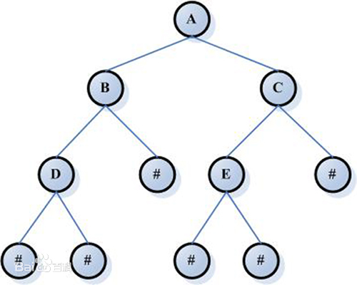
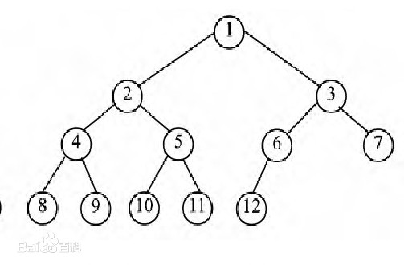
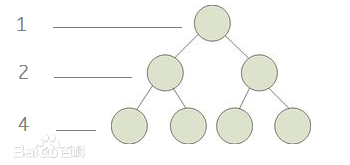
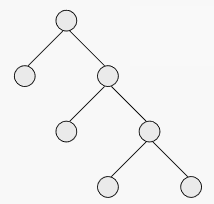
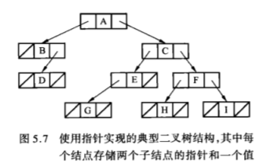

# dataStructuresAndAlgorithmsInGo(数据结构与算法Go语言实现)
Golang 语言中，数据类型分为四大类：
- 1 基础类型：数字、字符串、布尔型
- 2 聚合类型：数组、结构体
        通过组合基础类型得到的复杂的数据类型。
- 3 引用类型：指针、slice、map、函数、通道
        全部都是间接的指向程序变量或者状态
- 4 接口类型

这些数据类型在声明但是没有赋值的时候均为**零值**。
## 1、数组、集合

### 1.1 数组

数组是具有**固定长度**且拥有零个或多个**相同数据类型元素**的序列。数组为**值类型**，默认情况下使用的是**值传递**。

#### 1.1.1 静态数组
- 数组的定义
var 数组名 [数组大小]数据类型
例如：```var a [5]int```
默认情况下，一个数组的元素初始值为元素类型的零值。

- 数组的使用
四种初始化方法：
    ```go
    var numArr01 [3]int = [3]int{1, 2, 3}

    var numArr02 = [3]int{5, 6, 7}
    // [...]是固定写法，"..." 出现在数组长度位置，那么数组的长度由初始化数组的元素个数决定    
    var numArr03 = [...]int{8, 9, 10}

    // 使用“：”初始化的时候为数组的固定位置赋值
    var numArr04 = [...]int{1:5, 0:6, 2:7}

    numArr05 := [...]int{1:5, 0:6, 2:7}

    ```
    两类遍历方法：
    ```go
    // 常规遍历
    for i := 0; i < len(), i++ {
        ...
    }
    // for-range 结构遍历
    for index, value := range array01 {
        ...
    }
    ```

#### 1.1.2 动态数组slice
slice 表示一个拥有相同类型元素的可变长度序列。通常写成 ```[]T``` ，其中元素类型都为 T 。切片属于**引用类型**，使用方法和数组类似。
- slice 的定义
方式一：定义一个切片，然后让切片去引用一个已经创建好的数组。
    ```go
    var arr [5]int = [...]int{1, 2, 3, 4, 5}
    var slice = arr[1:3] // slice = {2, 3, 4}
    ```
    方式二：通过 make 来创建切片。
    基本语法：var 切片名 []type = make([]type, len, cap)
    其中：type 为数据类型，len为大小, cap 为切片容量（可选，如果选了则 cap >= len）。
    ```go
    var slice []float64 = make([]float6, 5, 10)
    slice[1] = 10
    slice[2] = 20
    ```
    通过 make 方式创建切片可以指定切片的大小和容量；如果没有给切片的各个元素赋初值，就会使用默认值；通过 make 创建的切片对应的底层数组由 make 底层维护，对外不可见，只能通过slice访问。
    方式三：定义一个切片就直接指定其具体数组，使用原理类似 make 的方式。
    ```go
    var strSlice []string = []string{"tom", "jack", "mary"}
    ```
- slice 的使用方式
切片的遍历和数组一样，也有两种方式。

### 1.2 map集合
map 是散列表的引用，是一个拥有键值对元素（key--value）的无序集合。在这个集合中，键的值是唯一的，键对应的值可以通过键来获取、更新或移除。**引用类型**
键的类型：必须是可以通过 == 操作符来进行比较的数据类型，一般是int 或者 string。slice、map 和 function 不可以。
值的类型：没有限制，常用的是数字、字符串、map、结构体等。
#### 1.2.1 静态map
- map 的声明与初始化
    var 变量名 map[keyType]valueType
    ```go
    var a map[int]int
    ```
    **注意**：声明不会分配内存的，初始化需要使用 make，分配内存后才可以赋值和使用。
    ```go
    // 声明
    var a map[string]string
    // 初始化
    a = make(map[string]string, 10)
    // 使用
    a["name1"] = "tom"
    a["name2"] = "jack"
    ```
    
    方式一：类似上面代码
    方式二：类型推导
    ```go
    cities := make(map[string]string)
    cities["name1"] = "北京"
    cities["name2"] = "上海"
    cities["name3"] = "天津"
    ```
    方式三：
    ```go
    cities := map[string]string{
        "name1" : "北京"
        "name2" : "上海"
        "name3" : "天津"
    }
    ```
- map 的使用    
使用 for--range 遍历。

#### 1.2.2 动态map (slice实现)
切片的数据类型如果是 map ,map 的个数就可以动态变化了。（map 切片）
```go
// 声明一个切片，这个切片是 map 类型的
var cities []map[string]string
cities = make([]map[string]string, 2)
// 第一个切片因为是 map 类型的，所以要先 make 一下，再增加信息
cities[0] = make(map[string]string, 2)
cities[0]["安徽"] = "合肥"
cities[0]["江苏"] = "南京"
cities[1] = make(map[string]string, 2)
cities[1]["美国"] = "芝加哥"
cities[1]["英国"] = "伦敦"
```

## 2、栈、队列和链表

此节主要是线性表的一些数据结构的具体实现。

### 2.1 栈

#### 2.1.1 栈的定义
栈（stack）又名堆栈，它是一种运算受限的 **线性表**。限定仅在表尾进行插入和删除操作的线性表。这一端被称为栈顶，相对地，把另一端称为栈底。

**线性表包括：**顺序表（数组、栈、队列）、链表


#### 2.1.2 栈的相关方法
- 1) push 方法
①若TOP≥n时，则给出溢出信息，作出错处理（进栈前首先检查栈是否已满，满则溢出；不满则作②）；
②置TOP=TOP+1（栈指针加1，指向进栈地址）；
③S(TOP)=X，结束（X为新进栈的元素）；
- 2) pop 方法
①若TOP≤0，则给出下溢信息，作出错处理(退栈前先检查是否已为空栈， 空则下溢；不空则作②)；
②X=S(TOP)，（退栈后的元素赋给X）：
③TOP=TOP-1，结束（栈指针减1，指向栈顶）。
- 3) top 方法
返回栈顶的元素。
- 4) len 方法
返回栈中的当前元素的个数。
- 5) is_empty 方法
判断栈是否为空，为空则返回true，否则返回false。
#### 2.1.3 使用 Golang 实现栈
- **1 思路**
根据栈的性质以及 go 中相关数据类型的知识，选择 **切片（slice）** 作为栈的主体存储结构。考虑到栈的容量问题：这里想到设计一个可以同时满足：固定容量或者可变容量的栈,所以考虑在结构体内加入 **cap** 字段。
    ```go
    // 这是一个栈的结构体
    type stack struct {

        // 一个栈的主体 ：可以接受所有类型的 interface{} 切片
        items []interface{}

        // 一个读写互斥锁：用于保护栈的数S据，防止读写的冲突操作
        lock sync.RWMutex

        // 一个栈容量：uint 类型，如果为 0 则表示容量自动增长无上限
        cap uint

        // 一个栈高度指针
        height uint

    }
    ```
- **2 注意事项**
**2.1** 因为对栈的主体存储结构切片的读写可能存在线程干扰，所以结构体内引入一个 **读写互斥锁** 用于保护栈的数S据，防止读写的冲突操作。
**2.2** 选用可以接受所有类型的 interface{} 切片，主要是考虑到在使用的时候可以满足不同数据类型入栈的需求。当然如果要在栈内存放单一数据类型，在使用的时候注意一下就行。
**2.3** 注意包下各个方法的返回值的类型，使用时可能需要使用类型断言。
- **3 完整源码**
包 datastructure/stack 下的代码stack.go
  
    ```go
  package stack
  
    import (
        "sync"
  )
  
    // 这是一个栈的结构体
  type stack struct {
  
        // 一个栈的主体 ：可以接受所有类型的 interface{} 切片
      items []interface{}
  
        // 一个读写互斥锁：用于保护栈的数S据，防止读写的冲突操作
      lock sync.RWMutex
  
        // 一个栈容量：uint 类型，如果为 0 则表示容量自动增长无上限
      cap uint
  
        // 一个栈高度指针
      height uint
  
    }

    // 创建栈s 
    // 将此方法绑定到 Stack 这个公开的栈的 struct 上面
    // 传入一个参数 cap (无符号整型) ，表示栈的容量：
    //      传入 0 表示需要创建的栈的容量无上限、自增长
    //      传入 uint 型的非 0 整数表示创建的栈容量有限
    func NewStack(cap uint) *stack {
        var s stack
        if cap != 0 {
        // 有容量限制
            s.items = make([]interface{}, cap)
            s.cap = cap
            return &s 
            
        } else {
            //无容量限制先默认栈的容量为 2 ，后面根据需要自动增长
            s.items =make([]interface{}, 2)
            s.cap = 0
            return &s 
        }
    }

    // 判断栈是否为空，为空则返回true，否则返回false。
    func (s *stack)IsEmpty() bool {
        if s.height == 0 {
            return true
        } else {
            return false
        }
    }

    // 返回顶元素
    func (s *stack)Top() interface{} {
        // 读之前要上锁
        s.lock.Lock()
        // 读完解锁
        defer s.lock.Unlock()

        if s.height > 0 {

            return s.items[s.height - 1]
        } else {

            return nil
        }
    }

    // 进栈操作
    func (s *stack)Push(item interface{}) bool {
        // 写之前要上锁
        s.lock.Lock()
        // 写完解锁
        defer s.lock.Unlock()
        if s.cap == 0 {
            // 表示是无限制自增长的栈
            s.items = append(s.items, item)
            return true
        } else if s.height < s.cap {
            // 有容量限制，且未满
            s.items[s.height] = item
            // 栈高增 1
            s.height++
            return true
        } else {
            // 栈内已满
            return false
        }
        
    }

    // 出栈操作
    func (s *stack)Pop() interface{} {
        // 写之前要上锁
        s.lock.Lock()
        // 写完解锁
        defer s.lock.Unlock()
        if s.IsEmpty() {
            //栈为空，不可以执行出栈操作
            return nil
        } else {
            // 栈非空
            item := s.items[s.height - 1]
            s.items = s.items[:s.height - 1]
            s.height--
            return item
        }
    }

    ```
    main包下的测试代码：
    ```go
    package main

    import (
        "fmt"
        "datastructure/stack"
    )

    func main()  {
        // 调用 stack 包下 NewStack 方法创建一个栈
        s := stack.NewStack(4)
        fmt.Println(s)
        _ = s.Push(1)
        fmt.Println("栈顶元素是：" , s.Top())
        _ = s.Push(2)
        fmt.Println("栈顶元素是：" , s.Top())
        _ = s.Push(3)
        fmt.Println(s.IsEmpty())
        fmt.Println("栈顶元素是：" , s.Top())
        result := s.Pop()
        fmt.Println("弹出的元素是：" , result)
        fmt.Println("此时栈顶元素是：" , s.Top())
        _ = s.Pop()
        _ = s.Pop()
        result = s.Pop()
        if result == nil {
            fmt.Println("此时的栈已空，弹不出来元素了")
        } else {
            fmt.Println("弹出的元素是", result)
        }

    }
    ```

**注意**：以上代码在可导出的函数NewStack中返回的是不可导出的局部变量，虽然使用起来不会有太大的影响，但是不符合 go 程序的设计规范，需要进行修改，修改后的程序见包中的实际代码

### 2.2 队列

#### 2.2.1 队列的定义
队列是一种特殊的 **线性表** ，特殊之处在于它只允许在表的前端（front）进行删除操作，而在表的后端（rear）进行插入操作，和栈一样，队列是一种操作受限制的线性表。进行插入操作的端称为队尾，进行删除操作的端称为队头。队列中没有元素时，称为空队列。
队列的数据元素又称为队列元素。在队列中插入一个队列元素称为入队，从队列中删除一个队列元素称为出队。因为队列只允许在一端插入，在另一端删除，所以只有最早进入队列的元素才能最先从队列中删除，故队列又称为先进先出（FIFO—first in first out）线性表
- **1 顺序队列**
建立顺序队列结构必须为其静态分配或动态申请一片连续的存储空间，并设置两个指针进行管理。一个是队头指针front，它指向队头元素；另一个是队尾指针rear，它指向下一个入队元素的存储位置，如图所示
每次在队尾插入一个元素是，rear增1；每次在队头删除一个元素时，front增1。随着插入和删除操作的进行，队列元素的个数不断变化，队列所占的存储空间也在为队列结构所分配的连续空间中移动。当front=rear时，队列中没有任何元素，称为空队列。当rear增加到指向分配的连续空间之外时，队列无法再插入新元素，但这时往往还有大量可用空间未被占用，这些空间是已经出队的队列元素曾经占用过得存储单元。
顺序队列中的溢出现象：
（1） "下溢"现象：当队列为空时，做出队运算产生的溢出现象。“下溢”是正常现象，常用作程序控制转移的条件。
（2）"真上溢"现象：当队列满时，做进栈运算产生空间溢出的现象。“真上溢”是一种出错状态，应设法避免。
（3）"假上溢"现象：由于入队和出队操作中，头尾指针只增加不减小，致使被删元素的空间永远无法重新利用。当队列中实际的元素个数远远小于向量空间的规模时，也可能由于尾指针已超越向量空间的上界而不能做入队操作。该现象称为"假上溢"现象。
- **2 循环队列**
在实际使用队列时，为了使队列空间能重复使用，往往对队列的使用方法稍加改进：无论插入或删除，一旦rear指针增1或front指针增1 时超出了所分配的队列空间，就让它指向这片连续空间的起始位置。自己真从MaxSize-1增1变到0，可用取余运算rear%MaxSize和front%MaxSize来实现。这实际上是把队列空间想象成一个环形空间，环形空间中的存储单元循环使用，用这种方法管理的队列也就称为循环队列。 **除了一些简单应用之外，真正实用的队列是循环队列。** 
在循环队列中，当队列为空时，有front=rear，而当所有队列空间全占满时，也有front=rear。为了区别这两种情况，规定循环队列最多只能有MaxSize-1个队列元素，当循环队列中只剩下一个空存储单元时，队列就已经满了。因此，队列判空的条件时front=rear，而队列判满的条件时front=（rear+1）%MaxSize。队空和队满的情况如图：

#### 2.2.2 队列的相关方法

1. 出队操作

   OutQueue：初始条件: 队q 存在且非空，操作结果： 删除队首元素，并返回其值，队发生变化；

2. 入队操作

   InQueue：初始条件:队q 存在。操作结果： 对已存在的队列q，插入一个元素x 到队尾，队发生变化；

3. 判满

   IsFull：判断队列是否已满，满返回true，否则返回false；

4. 判空

   IsEmpty：判断队列是否为空，空则返回true，否则返回false；

5. 取队头元素

   FrontQueue：返回队列的队头元素且不出队。

#### 2.2.3 使用切片实现循环队列
- **1 思路**

  根据队列的性质，考虑使用切片来实现栈的主体。由存在 front 和 rear 指针以及一个同步互斥锁，所以考虑如下结构体：

  ```go
  // 队列数据结构
  type circularQueue struct {
  
  	// 队列主体
  	queue []interface{}
  
  	// 队首队尾的指示
  	front, rear int
  
  	// 队列的容量
  	cap int
  
  	// 一个读写互斥锁：用于保护栈的数S据，防止读写的冲突操作
  	lock sync.RWMutex
  
  	// 注意，即使循环队列为满状态，也有一个位置是空着的
  }
  ```

  

- **2 注意事项**

  循环队列即使在满的状态下也有一个位置是空着不存放元素的。

- **3 完整源码**

  queue包下的 queue.go :

  ```go
  package queue
  
  // 队列的数组实现，(简单顺序队列的实用价值不高) 只实现循环队列
  import (
  	"sync"
  )
  
  // 队列数据结构
  type circularQueue struct {
  
  	// 队列主体
  	queue []interface{}
  
  	// 队首队尾的指示
  	front, rear int
  
  	// 队列的容量
  	cap int
  
  	// 一个读写互斥锁：用于保护栈的数S据，防止读写的冲突操作
  	lock sync.RWMutex
  
  	// 注意，即使循环队列为满状态，也有一个位置是空着的
  }
  
  //	队列初始化
  //	传入队列的长度
  func NewQueue(cap int) *circularQueue {
  	var cqueue circularQueue
  
  	if cap > 2 {
  		cqueue.queue = make([]interface{}, cap)
  
  	}
  	cqueue.cap = cap
  	// 传入的 cap <= 2 ，理论上这个队列是不可能存在的，所以返回的是nil
  	return &cqueue
  
  }
  
  // 出队操作
  // 队列有值可以返回就返回出队的值和true
  // 队列不满足出队条件就返回 nil 和 false
  func (cqueue *circularQueue) OutQueue() (interface{}, bool) {
  	// 读之前要上锁
  	cqueue.lock.Lock()
  	// 读完解锁
  	defer cqueue.lock.Unlock()
  	// 队列非空
  	if !cqueue.IsEmpty() {
  
  		item := cqueue.queue[cqueue.front]
  		// 队首指针指向下一个位置
  		cqueue.front = (cqueue.front + 1) % cqueue.cap
  
  		return item, true
  	}
  	return nil, false
  }
  
  // 入队操作 TODO
  func (cqueue *circularQueue) InQueue(item interface{}) bool {
  
  	// 读之前要上锁
  	cqueue.lock.Lock()
  	// 读完解锁
  	defer cqueue.lock.Unlock()
  
  	if !cqueue.IsFull() {
  
  		cqueue.queue[cqueue.rear] = item
  		// 队尾指针指向下一个位置
  		cqueue.rear = (cqueue.rear + 1) % cqueue.cap
  
  		return true
  	}
  	return false
  }
  
  // 判队空操作
  func (cqueue *circularQueue) IsEmpty() bool {
  	// 队首、尾指针一样的时候说明队列为空
  	if cqueue.front == cqueue.rear {
  		return true
  	}
  	return false
  }
  
  // 读队头元素
  // 队列非空即返回队头元素和 true
  // 队列为空则返回 nil 和 false
  func (cqueue *circularQueue) FrontQueue() (interface{}, bool) {
  	// 读之前要上锁
  	cqueue.lock.Lock()
  	// 读完解锁
  	defer cqueue.lock.Unlock()
  	if !cqueue.IsEmpty() {
  		return cqueue.queue[cqueue.front], true
  	}
  	return nil, false
  
  }
  
  // 判断队满操作
  func (cqueue *circularQueue) IsFull() bool {
  	// front=（rear+1）%MaxSize
  	if cqueue.front == (cqueue.rear+1)%cqueue.cap {
  		return true
  	}
  	return false
  }
  
  ```

  main 包下的测试代码：

  ```go
  	// 调用 queue 包下的 NewQueeu 方法创建一个循环队列
  	q := queue.NewQueue(5)
  	fmt.Println(q)
  	_ = q.InQueue(1)
  	_ = q.InQueue(2)
  	_ = q.InQueue(3)
  	resultQ, _ := q.FrontQueue()
  	fmt.Println("此时的队头元素是：", resultQ)
  	_ = q.InQueue(4)
  	for i := 0; i < 5; i++ {
  		resultQ, ok := q.OutQueue()
  		if ok {
  			fmt.Printf("第 %d 次出队成功，出队元素 %v \n", i+1, resultQ)
  		} else {
  			fmt.Printf("第 %d 次出队失败", i)
  		}
  	}
  ```

  **注意**：以上代码在可导出的函数NewQueue中返回的是不可导出的局部变量，虽然使用起来不会有太大的影响，但是不符合 go 程序的设计规范，需要进行修改，修改后的程序见包中的实际代码。

### 2.3 链表

#### 2.3.1 链表的定义

**链表**是一种物理存储单元上非连续、非顺序的存储结构，数据元素的逻辑顺序是通过链表中的指针链接次序实现的。链表由一系列**结点**（链表中每一个元素称为结点）组成，结点可以在运行时动态生成。**每个结点包括两个部分：一个是存储数据元素的数据域，另一个是存储下一个结点地址的指针域。** 相比于线性表顺序结构，操作复杂。由于不必须按顺序存储，链表在插入的时候可以达到O(1)的复杂度，比另一种线性表顺序表快得多，但是查找一个节点或者访问特定编号的节点则需要O(n)的时间，而线性表和顺序表相应的时间复杂度分别是O(logn)和O(1)。
使用链表结构可以克服数组链表需要预先知道数据大小的缺点，链表结构可以充分利用计算机内存空间，实现灵活的内存动态管理。但是链表失去了数组随机读取的优点，同时链表由于增加了结点的指针域，空间开销比较大。链表最明显的好处就是，常规数组排列关联项目的方式可能不同于这些数据项目在记忆体或磁盘上顺序，数据的存取往往要在不同的排列顺序中转换。链表允许插入和移除表上任意位置上的节点，但是不允许随机存取。链表有很多种不同的类型：单向链表，双向链表以及循环链表。

**单向链表：**


**双向链表：**


#### 2.3.2 链表的主要方法

- 插入函数

  在链表的指定位置插入结点。

  

- 删除函数

  删除指定位置的链表结点。

  

- 查找函数

  查找指定结点在链表中的位置。由于链表数据存取的不连续性，不能随机存取。所以在查找的时候只能顺序查找，时间复杂度在O(n)。

#### 2.3.3 使用 Golang 链表

​	**注：**在这里，我尝试去建立一个通用的单链表结构体并实现相关的查询、删除方法。但是在编写查找函数的时候遇见了很大的问题：想要这个结构体通用，则其接受的类型就设为了 interface ，但是两个**原始数据相等但是不相同**的 interface 类型如何比较是否是相等的？尝试使用reflect或者其他的一些办法没有解决比较值的这个问题，不能比较是否相等那就也不能在这个单链表上删除特定元素值的结点了。所以这一块卡住了，但是其他的函数：例如初始化、查询长度、插入函数。查找、删除这两个函数这一块的问题待以后解决吧。或者有大佬可以来给我指点一下。

​	代码在 *linklist/link_list.go*

```go
package linklist

import (

	// "C"
	"fmt"
	"sync"
)

// Node 为链表节点的数据结构
// 这里面 Next 和 Data 做导出
// 只是为了下面在实现队列或栈的链表实现的时候可以直接用这里面的
type Node struct {
	// 指针域
	Next *Node
	// 数据域
	Data interface{}
}

// LinkList 为链表的数据结构
type LinkList struct {
	// 链表的头节点
	head *Node
	// 链表的尾部
	tail *Node
	// 链表的长度
	len int
	// 一个读写互斥锁：用于保护数据，防止读写的冲突操作
	lock sync.RWMutex
}

// TODO: 下面所有的函数有很大的问题没有考虑到链表的尾部
// InitLinkList 初始化单链表
func (linkList *LinkList) InitLinkList() {
	var node Node
	// 这一块必须是创建的 Node 实例而不是 *Node。这样的话后面报 nil pointer 错误
	// 这一块是必须先创建结构体的变量实体，创建指针的话不指向指定结构体变量实体的话就是nil pointer错误
	linkList.lock.Lock()
	defer linkList.lock.Unlock()
	linkList.head = &node
	linkList.tail = &node
	linkList.len = 0
}

// // InitCirclList 初始化循环链表
// func InitCirclList() *Node {

// 	return nil
// }

// Length 查询链表长度
func (linkList *LinkList) Length() int {
	return linkList.len
}

// SerachInLinkList 单链表上查询（只查离链表头最近的一个的前一个结点）
// 传入一个 interface 类型的值，查询链上是否有此值
// 有的话返回这个值所在结点的前一个结点的指针及 true ，否则返回 nil 和 false
func (linkList *LinkList) SerachInLinkList(item interface{}) (*Node, bool) {
	for i := 0; i < linkList.len; i++ {
		currentNode := linkList.head
		// 都是 interface 类型，比较值相等不能使用 “ == ” 了
		// 可以使用 reflect 包下的 func DeepEqual(a1, a2 interface{}) bool
		// TODO: 比较这一块有问题，使用上面的也不太行，可能要用反射包里的东西
		// reflect.ValueOf(currentNode.Next.Data) == reflect.ValueOf(item)
		if currentNode.Next != nil &&
			currentNode.Next.Data == item {
			return currentNode, true
		}
	}
	return nil, false
}

// DeleteInLinkList 单链表上的删除（只删除离链表头最近的一个）
// TODO: 删除的逻辑要注意，注意删除的是链表尾部
func (linkList *LinkList) DeleteInLinkList(item interface{}) bool {
	// 修改前要加锁
	linkList.lock.Lock()
	defer linkList.lock.Unlock()
	beforeDeleteNode, _ := linkList.SerachInLinkList(item)
	if beforeDeleteNode.Next != nil {
		// 获取待删除结点指针
		deleteNode := beforeDeleteNode.Next
		// 从链上删除
		beforeDeleteNode.Next = deleteNode.Next
		// 删除的是链表尾
		if deleteNode == linkList.tail {
			linkList.tail = beforeDeleteNode
		}

		// TODO: 此处可能需要内存释放，考虑使用 cgo
		linkList.len--
		return true
	}
	return false

}

// InsertIntoLinkList 单链表上的插入操作
// 参数: node 为待插入的节点；position 为节点插入的位置，从0开始
// 返回值: true 表示插入成功，否则插入失败。失败可能是由于插入的位置不对
// 插入位置，从 1 开始，0 位置放的是头结点
func (linkList *LinkList) InsertIntoLinkList(node *Node, position int) bool {
	// 修改前要加锁
	linkList.lock.Lock()
	defer linkList.lock.Unlock()

	// 插入链表尾部
	if position == linkList.Length()+1 {
		linkList.tail.Next = node
		// 链表尾部必须指向后面（重要）
		linkList.tail = node
		linkList.len++
		return true
	} else {
		if position > 0 && position <= linkList.Length() {

			beforInsertNode := linkList.head
			// 找到待插入的前一个结点
			for i := 1; i < position; i++ {
				beforInsertNode = beforInsertNode.Next
			}
			// 断链插入
			node.Next = beforInsertNode.Next
			beforInsertNode.Next = node
			linkList.len++
			return true
		}

	}
	return false
}

// ShowList 打印链表
func (linkList *LinkList) ShowList() {
	curNode := linkList.head
	for i := 0; i < linkList.len; i++ {
		curNode = curNode.Next
		fmt.Println(curNode.Data)
	}
}

```

main下的测试代码如下：

```go
// 声明一个 linklist.LinkList 的结构体变量
	var list linklist.LinkList
	// 初始化链表
	(&list).InitLinkList()
	// 初始化 Node 结点
	var node1 linklist.Node
	node1.Data = 1
	var node2 linklist.Node
	node2.Data = 2
	var node3 linklist.Node
	node3.Data = 3
	var node4 linklist.Node
	node4.Data = 4
	// 放入 list 内
	list.InsertIntoLinkList(&node1, 1)
	list.InsertIntoLinkList(&node3, 1)
	list.InsertIntoLinkList(&node2, 1)
	list.InsertIntoLinkList(&node4, 1)

	// fmt.Println(&list)
	// fmt.Println(unsafe.Sizeof(node1.Next))
	// fmt.Println(unsafe.Sizeof(node1.Data))
	// fmt.Println(unsafe.Sizeof(list))

	list.ShowList()
	node, ok := list.SerachInLinkList(2)
	fmt.Println("3在结点", node, ok)
```


### 2.4 栈与队列的链表实现

因为上面的链表功能不够完善，部分函数存在问题，不能够满足栈和队列的实现需求，所以在上面链表的基础之上新增两个函数如下：

```go
// DeleteSP 删除从头结点开始的第 XX 个结点
// 也即删除指定序号的结点
// 删除成功返回删除的结点的值以及true；否则返回 nil 和 false
func (linkList *LinkList) DeleteSP(position int) (interface{}, bool) {
	// 要考虑好，删除的是链表上的第一个还是最后一个又或者是第一个和最后一个指向的是同一个结点
	if position > 0 {
		// 删除第一个且链表就一个元素
		if position == 1 && linkList.Length() == 1 {
			deleteNode := linkList.head.Next
			linkList.tail = linkList.head
			linkList.len--
			return deleteNode.Data, true
		} else if position == linkList.len {
			// 删除最后一个
			deleteNode := linkList.tail
			beforeNode := linkList.head
			// 找到最后一个结点的前一个结点
			for i := 1; i < linkList.len; i++ {
				beforeNode = beforeNode.Next
			}
			// 删除
			linkList.tail = beforeNode
			beforeNode.Next = nil
			linkList.len--
			return deleteNode.Data, true
		} else {
			// 删除这之间的结点
			beforeDeleteNode := linkList.head
			// deleteNode := linkList.head.Next
			// 找到待删结点的前一个结点
			for i := 1; i < position; i++ {
				beforeDeleteNode = beforeDeleteNode.Next
			}
			// 删除
			deleteNode := beforeDeleteNode.Next
			beforeDeleteNode.Next = deleteNode.Next
			linkList.len--
			return deleteNode.Data, true
		}

	}
	return nil, false
}

// SearchByID 根据位置查找结点
// 查找成功则返回查找到的结点以及 true ，否则返回 nil 和 false
func (linkList *LinkList) SearchByID(position int) (*Node, bool) {

	if position <= linkList.Length() && position > 0 {
		loNode := linkList.head
		for i := 1; i < position; i++ {
			loNode = loNode.Next
		}
		return loNode.Next, true
	}
	return nil, false
}
```


#### 2.4.1 使用链表实现栈

- **1 思路**

  

- **2 注意事项**

  栈的结构体中栈高度可以不需要了，链表的长度就是栈的高度。

- **3 完整源码**

  **stack/link_list_stack.go**

  ```go
  package stack
  
  import (
  	"datastructure/linklist"
  	"sync"
  )
  
  // Lstack 这是链表实现的栈的数据结构
  type Lstack struct {
  	// 栈的主体结构：链表
  	stack linklist.LinkList
  
  	// 一个读写互斥锁：用于保护栈的数S据，防止读写的冲突操作
  	lock sync.RWMutex
  
  	// 一个栈容量：int 类型，如果是复数则默认是无上限的
  	cap int
  
  	// 栈高度指针（就不用了，链表的长度就是栈的高度）
  	// height uint
  
  }
  
  // InitStack 创建栈s
  // 将此方法绑定到 Lstack 这个公开的栈的 struct 上面
  // 传入一个参数 cap (整型) ，表示栈的容量：
  //      传入 = 0 表示需要创建的栈的容量无上限、自增长
  //      传入 > 0 的非 0 整数表示创建的栈容量有限
  //      传入 < 0 的，参数错误，创建失败
  func (s *Lstack) InitStack(cap int) bool {
  	if cap >= 0 {
  		s.stack.InitLinkList()
  		s.cap = cap
  		return true
  	}
  	return false
  }
  
  // IsEmpty 判断栈是否为空，为空则返回true，否则返回false。
  func (s *Lstack) IsEmpty() bool {
  	if s.stack.Length() == 0 {
  		return true
  	}
  	return false
  }
  
  // Height 栈的高度
  func (s *Lstack) Height() int {
  	return s.stack.Length()
  }
  
  // Top 返回顶元素，也即返回链表的尾部
  func (s *Lstack) Top() (interface{}, bool) {
  	// 读之前要上锁
  	s.lock.Lock()
  	// 读完解锁
  	defer s.lock.Unlock()
  
  	if s.stack.Length() > 0 {
  		node, ok := s.stack.SearchByID(s.stack.Length())
  		if ok {
  			return node.Data, true
  		}
  	}
  	return nil, false
  }
  
  // Push 进栈操作
  func (s *Lstack) Push(item interface{}) bool {
  	// 写之前要上锁
  	s.lock.Lock()
  	// 写完解锁
  	defer s.lock.Unlock()
  	// 创建节点
  	var node linklist.Node
  	node.Data = item
  	// 进栈之前先判断
  	if s.cap == 0 || s.Height() < s.cap {
  		// 无上限的栈或者未满，直接就入栈了（放在链表尾部）
  		ok := s.stack.InsertIntoLinkList(&node, s.Height()+1)
  		if ok {
  			return true
  		}
  		return false
  	}
  	// 满了，放不下了
  	return false
  
  }
  
  // Pop 出栈操作
  func (s *Lstack) Pop() (interface{}, bool) {
  	// 写之前要上锁
  	s.lock.Lock()
  	// 写完解锁
  	defer s.lock.Unlock()
  	if !s.IsEmpty() {
  		// 栈非空，链表尾部节点删除（出栈）
  		item, ok := s.stack.DeleteSP(s.Height())
  		if ok {
  			return item, true
  		}
  	}
  	//栈为空，不可以执行出栈操作
  	return nil, false
  }
  
  ```

  **main.go中的测试代码：**

  ```go
  	// 声明一个 stack.Lstack 的结构体变量
  	var Ls stack.Lstack
  	// 调用 stack 包下 InitStack 方法初始化一个栈
  	Ls.InitStack(4)
  
  	fmt.Println(Ls)
  	_ = Ls.Push(1)
  	LsTop, _ := Ls.Top()
  	fmt.Println("栈的链表实现：栈顶元素是：", LsTop)
  	fmt.Println("栈的链表实现：栈高度是：", Ls.Height())
  	_ = Ls.Push(2)
  	LsTop, _ = Ls.Top()
  	fmt.Println("栈的链表实现：栈顶元素是：", LsTop)
  	_ = Ls.Push(3)
  	fmt.Println("此时栈为空吗？", Ls.IsEmpty())
  	fmt.Println("栈的链表实现：栈高度是：", Ls.Height())
  	LsTop, _ = Ls.Top()
  	fmt.Println("栈的链表实现：栈顶元素是：", LsTop)
  	LsResult, _ := Ls.Pop()
  	fmt.Println("栈的链表实现：弹出的元素是：", LsResult)
  	LsTop, _ = Ls.Top()
  	fmt.Println("栈的链表实现：此时栈顶元素是：", LsTop)
  	_, _ = Ls.Pop()
  	_, _ = Ls.Pop()
  	LsResult, _ = Ls.Pop()
  	if LsResult == nil {
  		fmt.Println("栈的链表实现：此时的栈已空，弹不出来元素了")
  	} else {
  		fmt.Println("栈的链表实现：弹出的元素是", LsResult)
  	}
  ```
  

#### 2.4.2 使用链表实现队列

- **1 思路**

  

- **2 注意事项**

  原始队列里面会有 front, rear  用于指示队首与队尾的位置，而现在可以不用了，单链表有 head 和 tail 。

- **3 完整源码**

  **queue/link_list_queue.go**

  ```go
  package queue
  
  // Linked list Queue
  // 队列的链表实现(　TODO:　待完成链表之后再来完成这一块)
  import (
  	"datastructure/linklist"
  	"sync"
  )
  
  // Queue 这是简单队列的结构体
  // 声明结构体变量之后需要执行 InitQueue 方法初始化队列
  type Queue struct {
  
  	// 队列主体
  	queue linklist.LinkList
  
  	// 队首队尾的指示可以不用了，单链表有 head 和 tail
  	// front, rear int
  
  	// 队列的容量
  	cap int
  
  	// 一个读写互斥锁：用于保护栈的数S据，防止读写的冲突操作
  	lock sync.RWMutex
  }
  
  // InitQueue 初始化队列
  // 传入 int 类型的队列的长度
  func (queue *Queue) InitQueue(cap int) bool {
  
  	if cap > 1 {
  		queue.queue.InitLinkList()
  		queue.cap = cap
  		return true
  	}
  	// 传入的 cap <= 1 ，理论上这个队列是不可能存在的
  	return false
  }
  
  // OutQueue 出队操作
  // 队列有值可以返回就返回出队的值和true
  // 队列不满足出队条件就返回 nil 和 false
  func (queue *Queue) OutQueue() (interface{}, bool) {
  	// 读之前要上锁
  	queue.lock.Lock()
  	// 读完解锁
  	defer queue.lock.Unlock()
  	// 直接调用
  	if queue.queue.Length() == 0 {
  		return nil, false
  	}
  	return queue.queue.DeleteSP(1)
  }
  
  // InQueue 入队操作
  func (queue *Queue) InQueue(item interface{}) bool {
  
  	// 读之前要上锁
  	queue.lock.Lock()
  	// 读完解锁
  	defer queue.lock.Unlock()
  	// 入队之前要判断队是否满
  	if queue.queue.Length() < queue.cap {
  		var inNode linklist.Node
  		inNode.Data = item
  		// 入队并返回入队操作的结果
  		return queue.queue.InsertIntoLinkList(&inNode, queue.queue.Length()+1)
  	}
  	return false
  }
  
  // IsEmpty 判队空操作
  func (queue *Queue) IsEmpty() bool {
  	// 队首、尾指针一样的时候说明队列为空
  	if queue.queue.Length() == 0 {
  		return true
  	}
  	return false
  }
  
  // FrontQueue 读队头元素
  // 队列非空即返回队头元素和 true
  // 队列为空则返回 nil 和 false
  func (queue *Queue) FrontQueue() (interface{}, bool) {
  	// 读之前要上锁
  	queue.lock.Lock()
  	// 读完解锁
  	defer queue.lock.Unlock()
  	node, ok := queue.queue.SearchByID(1)
  	if ok {
  		return node.Data, ok
  	}
  	return nil, ok
  
  }
  
  // IsFull 判断队满操作
  func (queue *Queue) IsFull() bool {
  	if queue.cap == queue.queue.Length() {
  		return true
  	}
  	return false
  }
  
  ```
  
  
  
  **main.go中的测试代码：**

  ```go
	// 声明一个 queue.Queue 的结构体变量
  	var lQ queue.Queue
	// 调用 queue 包下的 InitQueue 方法初始化循环队列
  	lQ.InitQueue(5)
  
  	fmt.Println(lQ)
  	_ = lQ.InQueue(1)
  	_ = lQ.InQueue(2)
  	_ = lQ.InQueue(3)
  	resultQ, _ = lQ.FrontQueue()
  	fmt.Println("队列的链表实现：此时的队头元素是：", resultQ)
  	_ = lQ.InQueue(4)
  	for i := 0; i < 5; i++ {
  		resultQ, ok := lQ.OutQueue()
  		if ok {
  			fmt.Printf("队列的链表实现：第 %d 次出队成功，出队元素 %v \n", i+1, resultQ)
  		} else {
  			fmt.Printf("队列的链表实现：第 %d 次出队失败\n", i)
  		}
  	}
  }
  ```
  
  ### 2.5 注意：
  
  以上涉及链表中结点删除的操作均未考虑内存释放的问题，默认就是交给 go 自己的垃圾回收机制管理了。如果要自己做内存释放的话可能要用CGO去做哦。

  

## 4、树

​	上一部分讲的顺序表和链表的实现都不够令人满意：不是检索速度快、就是易于插入新的节点，但是不能同时具有这两个优点。但是树却可以同时具有以上两个特性，且在其上的大部分操作的运行时间平均是 O(log N) 。

### 4.1 二叉树

#### 4.1.1 二叉树的定义及特性

一棵二叉树（binary tree）是由结点的有限集合组成的，这个集合或者为空或者由一个根节点（root）以及两棵不相交的二叉树组成，这两棵子树分别称为当前根节点的左子树（left subtree）与右子树（right subtree）。而这两棵子树的根节点有分别成为当前根节点的子节点。



##### a) 完全二叉树

从根节点开始，每一层从左向右填充。



一棵深度为k的有n个结点的二叉树，对树中的结点按从上至下、从左到右的顺序进行编号，如果编号为i（1≤i≤n）的结点与满二叉树中编号为i的结点在二叉树中的位置相同，则这棵二叉树称为完全二叉树。

一棵高度为 d 的完全二叉树除了 d - 1 层外，其他每一层都是满的。

##### b) 满二叉树

对于满二叉树国内外的定义是不一样的。这里我们按照国内的来吧。

**国内定义：**一个二叉树，如果每一个层的结点数都达到最大值，则这个二叉树就是满二叉树。也就是说，如果一个二叉树的层数为K，且结点总数是(2^k) -1 ，则它就是满二叉树。



**国外定义：**如果一棵二叉树的结点要么是叶子结点，要么它有两个子结点，这样的树就是满二叉树



#### 4.1.2 二叉树的主要实现方法

##### A）指针实现

使用指针实现二叉树，每个结点存储两个字节的的指针和一个本结点的存储值。



golang 实现的结构体如下：

```go
// TNode 树的结点结构体
type TNode struct {
	// 左孩子指针
	left *TNode
	// 右孩子指针
	right *TNode
	// 数据域
	element int
}

// Tree 树的结构体
type Tree struct {
	// 根节点
	root *TNode
}
```

**注：**这里为了避免出现上面链表在查找时候的问题，即 interface 间值比较的问题，就简单一点，data 的类型取 int 得了。（如果之后可以解决这个问题，那以后再改）

##### B）数组实现

使用数组存储二叉树有利有弊，一般来说都是在数组中存入有规律易寻找的树类型，例如完全二叉树或满二叉树。

假设在完全二叉树中，逐层而下、从左到右，结点的位置完全由其序号决定。则可以采用数组有效的存储二叉树的数据，把每一个数据存放在其结点对应序号的位置上。

#### 4.1.3 二叉树的遍历、查找等相关函数

#### 4.1.4 不同类型二叉树的判别

##### A）完全二叉树

**算法思路：**

判断一棵树是否是完全二叉树的思路 ：

​		1>如果树为空，则直接返回错
　　2>如果树不为空：层序遍历二叉树
　　2.1>如果一个结点左右孩子都不为空，则pop该节点，将其左右孩子入队列；
　　2.1>如果遇到一个结点，左孩子为空，右孩子不为空，则该树一定不是完全二叉树；
　　2.2>如果遇到一个结点，左孩子不为空，右孩子为空；或者左右孩子都为空；则该节点之后的队列中的结点都为叶子节点；该树才是完全二叉树，否则就不是完全二叉树；

**代码实现：**


##### B）满二叉树

#### 4.1.5 二叉树的特殊应用


### 4.2 树

#### 4.2.1 树的定义与特性

#### 4.2.1 树的实现

#### 4.2.1 K 叉树

#### 4.2.1 树的顺序表示法

## 5、优先级队列

## 6、映射、哈希表和跳跃表

## 7、搜索树

## 8、排序

## 9、查找

## 10、图

## 11、字符串

## 12、文本处理

## 13、内存管理和 B 树